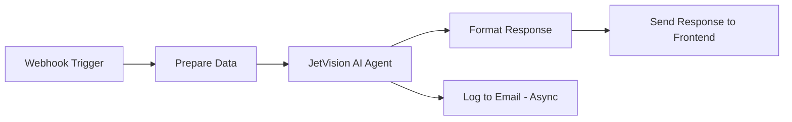

# n8n Webhook Configuration Guide for JetVision Agent

## Critical Issues Fixed

### 1. ❌ **Original Issue: Response Timing**
- **Problem**: Webhook was set to `responseNode` mode with "Respond to Webhook" placed AFTER AI processing and email sending
- **Impact**: Frontend experiences 10+ second delays waiting for AI and email to complete
- **Fix**: Changed to sequential flow with response immediately after AI processing

### 2. ❌ **Original Issue: Field Mapping**
- **Problem**: AI Agent expects `query` but frontend sends `message`
- **Impact**: Empty or undefined queries to the AI agent
- **Fix**: Added "Prepare Data" node to normalize incoming data

### 3. ❌ **Original Issue: No Error Handling**
- **Problem**: Workflow fails silently without returning errors to frontend
- **Impact**: Frontend timeouts with no user feedback
- **Fix**: Added error handling with user-friendly fallback messages

## Step-by-Step Implementation

### Step 1: Update Webhook Trigger Node
```json
{
  "httpMethod": "POST",
  "path": "jetvision-agent",
  "responseMode": "lastNode",  // Changed from "responseNode"
  "options": {
    "allowedOrigins": "*",
    "rawBody": false
  }
}
```

### Step 2: Add Data Preparation Node (Code Node)
Add this IMMEDIATELY after the webhook trigger:
```javascript
// Extract and validate the incoming request
const body = $input.item.json.body || $input.item.json;
const message = body.message || body.prompt || body.query || '';
const context = body.context || {};
const threadId = body.threadId || '';

// Prepare data for the agent
return {
  query: message,  // AI Agent expects 'query'
  message: message,
  threadId: threadId,
  context: context,
  timestamp: new Date().toISOString(),
  source: context.source || 'jetvision-agent'
};
```

### Step 3: Configure AI Agent Error Handling
Set the JetVision Agent node to:
- **On Error**: "Continue (using error output)"
- **Execution Timeout**: 8 seconds (leaves 2s buffer for response)

### Step 4: Add Response Formatting Node (Code Node)
```javascript
// Format the response for the frontend
const agentResponse = $input.item.json.output || $input.item.json.text || '';
const error = $input.item.error;

if (error) {
  return {
    success: false,
    error: error.message || 'An error occurred',
    message: 'I encountered an issue. Please try again.',
    timestamp: new Date().toISOString()
  };
}

// Success response
return {
  success: true,
  response: agentResponse,
  message: agentResponse,
  text: agentResponse,
  metadata: {
    model: 'jetvision-agent',
    timestamp: new Date().toISOString()
  }
};
```

### Step 5: Configure Response Node
```json
{
  "respondWith": "json",
  "responseBody": "={{ $json }}",
  "options": {
    "responseCode": 200,
    "responseHeaders": {
      "Content-Type": "application/json",
      "Access-Control-Allow-Origin": "*"
    }
  }
}
```

## Workflow Execution Flow



## Performance Optimizations

### 1. **Immediate Acknowledgment Pattern** (Alternative)
If AI processing takes too long, implement this pattern:

```javascript
// Quick Acknowledgment Node (after webhook)
return {
  status: "processing",
  message: "Processing your request...",
  requestId: generateId()
}
// Then continue with AI processing in background
```

### 2. **Caching Strategy**
Add a cache check before AI processing:
```javascript
// Check if we've seen this query recently
const cacheKey = crypto.createHash('md5').update(message).digest('hex');
const cached = await cache.get(cacheKey);
if (cached) {
  return { response: cached, fromCache: true };
}
```

### 3. **Timeout Configuration**
- Webhook timeout: 10 seconds (frontend setting)
- n8n workflow timeout: 9 seconds
- AI Agent timeout: 8 seconds
- Buffer for response: 1-2 seconds

## Testing Strategy

### 1. **Basic Connectivity Test**
```bash
curl -X POST https://n8n.vividwalls.blog/webhook/jetvision-agent \
  -H "Content-Type: application/json" \
  -d '{"message":"Test connection","threadId":"test-123"}'
```

Expected response (< 1 second):
```json
{
  "success": true,
  "response": "Connection successful",
  "timestamp": "2024-01-27T..."
}
```

### 2. **Apollo.io Query Test**
```bash
curl -X POST https://n8n.vividwalls.blog/webhook/jetvision-agent \
  -H "Content-Type: application/json" \
  -d '{"message":"Find executive assistants at NYC private equity firms"}'
```

### 3. **Avinode Query Test**
```bash
curl -X POST https://n8n.vividwalls.blog/webhook/jetvision-agent \
  -H "Content-Type: application/json" \
  -d '{"message":"Show available aircraft for tomorrow Miami to New York"}'
```

### 4. **Error Handling Test**
```bash
curl -X POST https://n8n.vividwalls.blog/webhook/jetvision-agent \
  -H "Content-Type: application/json" \
  -d '{"invalid":"data"}'
```

Should return graceful error response.

## Frontend Integration Updates

Update the frontend to handle the new response format:

```typescript
// In n8n-webhook/route.ts
const n8nData = await n8nResponse.json();

// Handle different response formats
const responseText = 
  n8nData.response || 
  n8nData.message || 
  n8nData.text || 
  'Processing complete';

// Check for errors
if (!n8nData.success && n8nData.error) {
  console.error('n8n error:', n8nData.error);
  // Provide user-friendly message
}
```

## Monitoring & Debugging

### Enable n8n Workflow Logging
1. Go to Workflow Settings
2. Enable "Save Execution Progress"
3. Set "Save Successful Executions" to "All"
4. Monitor execution times in n8n UI

### Key Metrics to Track
- Webhook response time (target: < 3 seconds)
- AI processing time (target: < 5 seconds)
- Error rate (target: < 5%)
- Timeout rate (target: < 1%)

### Debug Checklist
- [ ] Webhook URL is accessible from internet
- [ ] Workflow is Active (not just in test mode)
- [ ] All credentials are configured
- [ ] CORS headers are properly set
- [ ] Response format matches frontend expectations
- [ ] Error handling returns proper JSON
- [ ] Timeouts are configured correctly

## Common Issues & Solutions

### Issue 1: "Webhook Timeout"
**Cause**: Workflow takes longer than frontend timeout
**Solution**: Implement immediate acknowledgment pattern or optimize AI agent

### Issue 2: "Empty Response"
**Cause**: Field mapping mismatch
**Solution**: Use Prepare Data node to normalize input

### Issue 3: "CORS Error"
**Cause**: Missing or incorrect headers
**Solution**: Add proper CORS headers in webhook settings

### Issue 4: "Authentication Failed"
**Cause**: API key mismatch or missing
**Solution**: Verify webhook accepts unauthenticated requests or add auth

## Production Deployment Checklist

1. **Activate Workflow**: Change from test to production mode
2. **Set Proper Timeouts**: Configure all timeout values
3. **Enable Error Workflow**: Create error handler workflow
4. **Configure Monitoring**: Set up alerts for failures
5. **Test All Paths**: Verify success and error scenarios
6. **Document Webhook URL**: Update frontend configuration
7. **Enable Logging**: For debugging production issues
8. **Set Rate Limits**: Prevent abuse
9. **Configure Backup**: Export workflow regularly
10. **Monitor Performance**: Track response times

## Next Steps

1. **Import the optimized workflow** (N8N_WORKFLOW_OPTIMIZED.json) into n8n
2. **Test with curl commands** to verify basic functionality
3. **Update frontend timeout** to 10 seconds if not already done
4. **Monitor first 100 requests** to identify any issues
5. **Optimize AI agent prompts** based on actual usage patterns